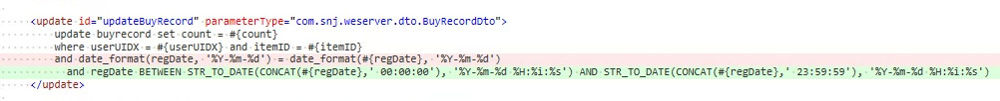
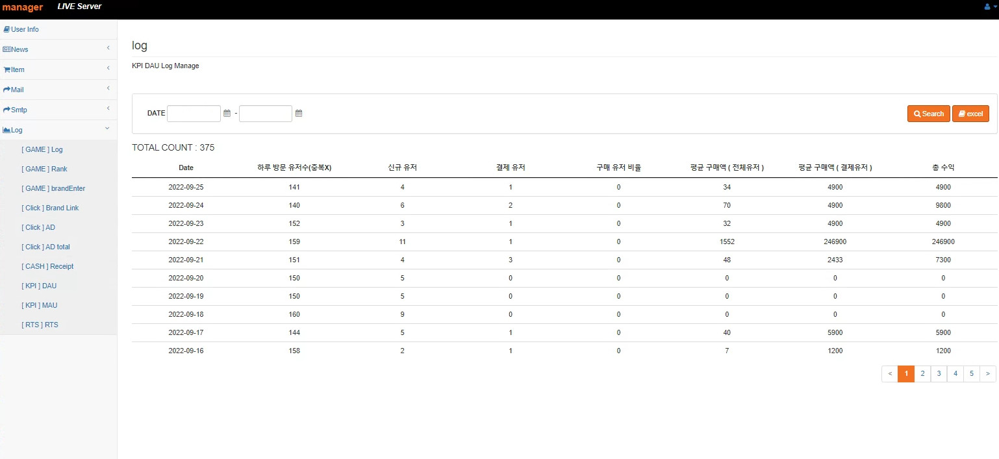

# portfolio
### Introduction
- 게임 서버 개발자 김윤겸입니다.
- 깔끔하고 읽기 좋은 코드작성을 좋아합니다.
- 코드 리딩하는걸 좋아하며 팀원끼리 정보를 공유합니다.
- 게임 기획에 참여시 자신의 생각을 잘 표현하며 전달합니다.
- 업무를 진행시 최대한 이타적으로 업무를 진행하려고 노력하는 타입입니다.
- 새로운 기술 사용하는 것에 긍정적입니다.

### Contact & Channel
- Email | kukkkkkk@naver.com
- Github | https://github.com/yoonkyumkim

# Skills

### Language

- Java
- JavaScript

### Framework

- Springboot
- Protocol buffers
- Netty
- Nodejs

### Cache Server

- redis

### Database

- Mysql
- Mssql
- Oracle

### DevOps

- Jenkins
- Chef

### Cloud Server

- Amazon Web Service

### OS

- Amazon linux
- Centos
- Ubuntu

### Collaboration

- Slack
- Trello
- Jandi
- Discord
- Asana
- Confluence

### Version Control

- Github
- SVN

### Certificate / License

- 정보처리기사

# Projects

### World Economy (https://play.google.com/store/apps/details?id=com.snjsoft.WorldEconomy)
- 시티류 SNG 게임

### 개발
- java, springboot 기반의 전반적인 게임 컨텐츠 개발
- 상시, 일일 퀘스트 개발
- 업적 시스템 개발
- 클럽 시스템 개발
- 생산, 건물 건설 기능 개발
- 랭킹 시스템 개발 및 동기화 구현
- 실시간 메신져 기능 개발 (netty)
- 거래소 시스템 개발
- 가챠 시스템 개발
- DB 설계 및 최적화 쿼리 작성
- Shardingsphere 를 사용하여 Sharding 구현
- 결제 영수증 검증 개발
- JWT Token 검증 개발
- 라이브 서비스 이슈 대응
- AWS 서버 인프 구축

<!--
### 기획
- 서버 데이터 구조 설계
- DB migration
- 실시간 랭킹 동기화 구조 설계
- 거래소 구조적 이슈 재설계
- 퀘스트 구조적 문제 해결법 설계
- 클럽 시스템 설계
 -->

### 기타
- 운영툴 1인개발
- 운영 지표툴 개발 (KPI)


### Mad For Dance (https://www.birdletter.com/mad-for-dancce)
 - 2019년 Google 창구 프로그램 오디션 1위 (http://www.inven.co.kr/webzine/news/?news=227414)


### 개발
- 1인 서버 개발(게임의 모든 컨텐츠 및 시스템 개발)
- 업적 시스템 개발
- 친구 시스템 개발
- 데이터 저장 및 동기화 개발
- 인앱 영수증 검증 개발
- 플랫폼간 데이터 연동 기능 구현
- AWS 서버 인프라 구축

<!--
### 기획
- 서버 테이블 구조 설계
- 레벨 디자인 피드백
- 컨텐츠 기획
-->

### 기타
- 운영툴 개발
- 지표툴 개발(KPI)

# Work Experience

### 분리 되어있던 인게임 보상처리를 한곳에 묶음 처리 (Reflection 사용)
```cs
public RewardTotalData insertReward(long userUIDX, int rewardID, int eventID, boolean isOrderQuest, boolean isTutorial) throws NoSuchMethodException, InvocationTargetException, IllegalAccessException {

        Map<String, Integer> resultMap = new HashMap<>();

        RewardTotalData.Builder res = RewardTotalData.newBuilder();

        QuestReward rewardGD = GameDataGD.instance.getQuestRewardGD().get(rewardID);

        for (int i = 1; i <= 4; i++) {

            int rewardType = (int) rewardGD.getClass().getMethod("getRewardType0" + i).invoke(rewardGD);
            int rewardId = (int) rewardGD.getClass().getMethod("getRewardId0" + i).invoke(rewardGD);
            int rewardVal = (int) rewardGD.getClass().getMethod("getItemVal0" + i).invoke(rewardGD);

            if (isOrderQuest) {
                rewardVal = rewardVal * eventID;
            }
            if (rewardType == REWARD_TYPE.MONEY_VALUE) {

                MoneyDto moneyDto;
                if (isOrderQuest) {
                    Map<Integer, Double> targetBuff = buffManager.orderQuestBuff(userUIDX);
                    rewardVal += (rewardVal * (targetBuff == null ? 0 : targetBuff.getOrDefault(Buff_Type.ORDERQUEST_REWARD_VALUE, (double) 0)));
                    moneyDto = moneyManager.calculateGold(userUIDX, rewardVal);
                } else {
                    boolean isMoneyType = rewardId == Money_Type.CASH_VALUE;
                    moneyDto = isMoneyType ? moneyManager.calculateCash(userUIDX, rewardVal, false) : moneyManager.calculateGold(userUIDX, rewardVal);
                }
                res.addMoneyData(moneyDto.toProto());

            } else if (rewardType == REWARD_TYPE.ITEM_VALUE) {
                ItemDto itemDto = itemManager.addItem(userUIDX, rewardId, rewardVal, resultMap);
                res.addItemData(itemDto.toProto());
            } else if (rewardType == REWARD_TYPE.ROOMITEM_VALUE) {
                RoomItemDto roomItemDto = roomItemManager.makeRoomItem(userUIDX, rewardId);
                res.addRoomItemData(roomItemDto.toProto());
            } else if (rewardType == REWARD_TYPE.ROOMCHARACTER_VALUE) {
                CharacterDto characterDto = characterManager.makeCharacter(userUIDX, rewardId);
                res.addCharacterData(characterDto.toProto());
            } else if (rewardType == REWARD_TYPE.ROOMCOSTUME_VALUE) {
                CostumeDto costumeDto = costumeManager.makeCostume(userUIDX, rewardId);
                res.addCostumeData(costumeDto.toProto());
            } else if (rewardType == REWARD_TYPE.BRANDPOINT_VALUE) {
                if (isTutorial) {
                    // 점수 업데이트만 - 셀렉트는 다른 곳에서? - 추후 리팩토링
                    tutorialManager.updateTutorialScore(userUIDX, rewardVal, TUTORIAL_TYPE.TUTORIAL_BRAND_VALUE);
                } else {
                    BrandRecordDto brandRecordDto = questManager.brandRecordUpdate(userUIDX, eventID, rewardVal);
                    res.setBrandRecordData(brandRecordDto.toProto());
                }
            } else if (rewardType == REWARD_TYPE.COUPON_VALUE) {
                CouponDto couponDto = couponManager.makeCoupon(userUIDX, rewardId, rewardVal);
                res.addCouponData(couponDto.toProto());
            } else if (rewardType == REWARD_TYPE.ICON_VALUE) {
                userManager.insertProfileIcon(userUIDX, rewardId);
            } else if (rewardType == REWARD_TYPE.FRAME_VALUE) {
                userManager.insertProfileFrame(userUIDX, rewardId);
            }

        }
        return res.build();
    }
```

### 클라이언트의 모든 요청을 Mapping 하는 로직(JWT사용)
```cs
Class klass = Class.forName(CLASS_PACKET_BASE_SUFFIX + packet);
            if (isProto) {
                // protobuf 형식
                Method parseFrom = klass.getMethod(PACKET_BASE_PARSE_METHOD, byte[].class);
                req = (Message) parseFrom.invoke(klass, payload);
            } else {
                // json 포맷 형식
                Method newBuilder = klass.getMethod(JSON_BASE_PARSE_METHOD);
                Message.Builder builder = (Message.Builder) newBuilder.invoke(klass);
                JsonFormat.parser().merge(new String(payload), builder);
                req = builder.build();
            }

            Session session = null;
            // 화이트 리스트에 없는 endpoint 는 권한 검사를 실행한다.
            if (!AUTH_WHITELIST_SET.contains(packet)) {

                if (!headerMap.containsKey("jwt")) throw new WEError(RESULT.PACKET_ERROR, "jwt empty packet error.");

                //sst 가 있으면 확인한다.
                Claims claims = tokenManager.parseJwt((String) headerMap.get("jwt"));
                userUIDX = claims.get("uid", String.class);
                //jwt 성공 하면 claim 을 얻어와서 레디스에서 정보를 찾아 온다.
                // Claims 의 형변환과 레디스에서 값을 읽어 들이는것 모두 확인 해본다.
                session = redisDao.getSession(Long.parseLong(claims.get("uid", String.class)));

                if (session != null && session.getExpireTime() != claims.getExpiration().getTime())
                    throw new WEError(RESULT.SESSION_ERROR, "expireTime different error.");
            }

            logger.info(String.format("[packName]: %s, [userUIDX]: %s, [request]: %s", packet, userUIDX, req));

            IProtoHandler handler = (IProtoHandler) applicationContext.getBean(packet + CLASS_SERVICE_BASE_PREFIX);
            return handler.proc(session, req);
```

### 통신에 필요한 JWT 를 생성하는 로직
```cs
public String makeJWT(UserDto userDto) {

        Date nowDate = ServerTime.dow();

        Claims claims = Jwts.claims().setSubject("WeAccessToken");
        claims.put(Const.JWT_UID, userDto.getUserUIDX().toString());
        claims.put(Const.JWT_NID, userDto.getNationID().toString());

        return tokenProvider.generateToken(claims, nowDate);
    }

    public Claims parseJwt(String jwt) {
        Claims claims = parseJwtToJws(jwt).getBody(); // 정상 수행된다면 해당 토큰은 정상토큰
        logger.debug(String.format("[checkJWT] nationID : %s, userUIDX : %s", claims.get(Const.JWT_NID), claims.get(Const.JWT_UID)));
        return claims;
    }

    public Jws<Claims> parseJwtToJws(String jwt) {

        if (jwt == null)
            throw new WEError(RESULT.SESSION_ERROR, "token null error.");

        try {
            return tokenProvider.decodeTokenToJws(jwt);

        } catch (ExpiredJwtException exception) {
            logger.info("토큰 만료");
            throw new WEError(RESULT.SESSION_ERROR, "token expire error.");
        } catch (JwtException exception) {
            logger.info("토큰 변조");
            throw new WEError(RESULT.SESSION_ERROR, "token expire error.");
        } catch (Exception e) {
            throw new WEError(RESULT.SESSION_ERROR, "token invalid error.");
        }
    }
```

### 유저의 랭킹을 실시간으로 관리
```cs
public void addRankPoint(long uidx, int score) {

        RankingUser User = null;
        RankingUser newUser = null;
        RankingUser beforeUser = null;

        int totalScore = 0;

        User = map.get(uidx);

        if (User == null) { // 유저가 없으면 새로 추가
            totalScore = score;
        } else { //유저가 있으면 스코어를 더해 준다.
            totalScore = score + User.getScore();
        }

        newUser = new RankingUser(uidx, totalScore, 0);
        beforeUser = map.put(uidx, newUser);
        if (beforeUser != null)
            set.remove(beforeUser);
        set.add(newUser);

    }

    public RankingUser getRanking(long uidx) {
        //serverLogger.trace("[ Get Ranking ] uidx : {}", uidx);
        RankingUser u = map.get(uidx);
        if (u == null)
            return null;

        u.setRank(set.headSet(u).size() + 1);
        return u;
    }

    public List<RankingUser> getTopRanker(int count, int offset) {
        //serverLogger.info("[ Get Top Ranker ] count : {}, offset : {}", count, offset);
        List<RankingUser> targetList = set.stream().skip(offset).limit(count).collect(Collectors.toList());

        int rank = offset + 1;
        for (RankingUser rankData : targetList) {
            rankData.setRank(rank);
            rank++;
        }

        return targetList;
    }
```

### 랭킹 정렬 조건 로직
```cs
@Override
    public String toString() {
        return "User{" +
                "uidx=" + uidx +
                ", score=" + score +
                '}';
    }

    @Override
    public int compareTo( RankingUser o) {
        if (score != o.score)
            return o.score - score;

        return (int) (o.uidx - uidx);
    }
```

### 소켓 서버 유저 로그아웃에 대한 BroadCast 및 세션처리
```cs

  SessionManager sessionManager = BeanUtils.getBean(SessionManager.class);
  //// 내 친구들에게 내가 로그 아웃 했다 것을 알린다.
  System.out.println("channel inactive. send msg... from userUIDX : " + userUIDX );
  SMeetingRoomLeave.Builder meetRoomLeave = 
  SMeetingRoomLeave.newBuilder().setOutUIDX(userUIDX);
  OneMessage Payload = OneMessage.newBuilder()
   .setMessageType(MessageType.SMEETINGROOMLEAVE )
   .setSmeetingroomleave(meetRoomLeave)
   .setResultCode(RESULT.OK)
   .build();
  sessionManager.sendMeetMemberLeave(userUIDX, Payload);
  sessionManager.removeMeetMember(userUIDX);
  SLogout res = SLogout.newBuilder().setUserUIDX( userUIDX ).build();
  response.setMessageType(MessageType.SLOGOUT);

  response.setSlogout(res);
  sessionManager.sendOneMessageMyPartner(userUIDX, response.build());
  sessionManager.removeUserSession( userUIDX );
  if (clubUIDX != 0 )
   sessionManager.deleteClubSession(clubUIDX, userUIDX)

```

### 지연 쿼리 이슈 해결
- where 절에 date_format 을 사용하여 지연이 되는 쿼리를 찾아 수정




### 운영 지표툴 개발화면


