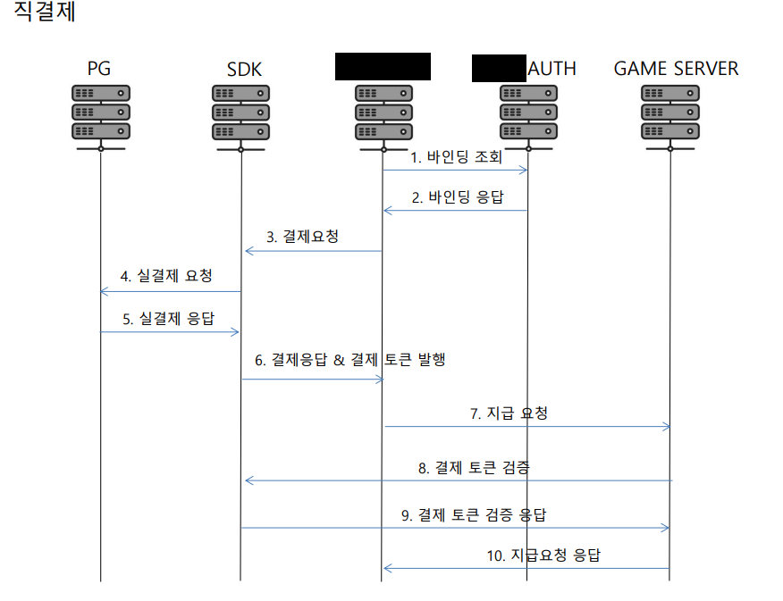

# portfolio
### Introduction
- 게임 서버 개발자 김윤겸입니다.
- 깔끔하고 읽기 좋은 코드작성을 좋아합니다.
- 코드 리딩하는걸 좋아하며 팀원끼리 정보를 공유하는걸 좋아합니다.
- 게임 기획에 참여시 자신의 생각을 잘 표현하며 전달합니다.
- 업무를 진행시 소통을 중요하게 생각합니다.
- 새로운 기술 사용하는 것에 긍정적입니다.

### Contact & Channel
- Email | kukkkkkk@naver.com
- Github | https://github.com/yoonkyumkim
- Discord | 에버#0705
# Skills

### Language

- Java
- JavaScript
- TypeScript
- C#

### Framework

- Springboot
- Protocol buffers
- Netty
- Nodejs
- express
- Pomelo

### Cache Server

- redis

### Database

- Mysql
- Oracle

### DevOps

- Jenkins
- Chef

### Cloud Server

- Amazon Web Service

### OS

- Amazon linux
- Centos
- Ubuntu

### Collaboration

- Slack
- Trello
- Jandi
- Discord
- Asana
- Confluence

### Version Control

- Github
- SVN

### Certificate / License

- 정보처리기사

# Projects
### Fortress M

- 온라인 포격 게임
### 개발
- nodejs, pomelo 기반의 게임 컨텐츠 개발
- 업적, 이벤트 퀘스트 개발
- 카드 합성 시스템 개발
- 클랜 시스템 개선
- 코드 리팩터링
- 로그인 SDK 개발
- DB 설계 및 최적화
- 비동기 처리

<p></p>
<p></p> 

### World Economy

- 시티류 SNG 게임

### 개발
- java, springboot 기반의 전반적인 게임 컨텐츠 개발
- 상시, 일일 퀘스트 개발
- 업적 시스템 개발
- 클럽 시스템 개발
- 생산, 건물 건설 기능 개발
- 랭킹 시스템 개발 및 동기화 구현
- 실시간 메신져 기능 개발 (netty)
- 거래소 시스템 개발
- 가챠 시스템 개발
- DB 설계 및 최적화 쿼리 작성
- Shardingsphere 를 사용하여 Sharding 구현
- 결제 영수증 검증 개발
- JWT Token 검증 개발
- 라이브 서비스 이슈 대응
- AWS 서버 인프라 구축

<!--
### 기획
- 서버 데이터 구조 설계
- DB migration
- 실시간 랭킹 동기화 구조 설계
- 거래소 구조적 이슈 재설계
- 퀘스트 구조적 문제 해결법 설계
- 클럽 시스템 설계
- 전체적인 팀원 멘탈 케어
 -->

### 기타
- 운영툴 개발
- 운영 지표툴 개발 (KPI)

<p></p>
<p></p> 

### Mad For Dance (https://play.google.com/store/apps/details?id=com.birdletter.mfd)

- 2019년 Google 창구 프로그램 오디션 1위 (http://www.inven.co.kr/webzine/news/?news=227414)


### 개발
- 1인 서버 개발(게임의 모든 컨텐츠 및 시스템 개발)
- 업적 시스템 개발
- 친구 시스템 개발
- 데이터 저장 및 동기화 개발
- 인앱 영수증 검증 개발
- 플랫폼간 데이터 연동 기능 구현
- AWS 서버 인프라 구축

<!--
### 기획
- 서버 테이블 구조 설계
- 레벨 디자인 피드백
- 컨텐츠 기획
- 랭킹시스템 
-->

### 기타
- 운영툴 개발
- 지표툴 개발(KPI)

<p></p> 
<p></p> 

### Hortensia Saga (https://namu.wiki/w/%EC%98%A4%EB%A5%B4%ED%85%90%EC%8B%9C%EC%95%84%20%EC%82%AC%EA%B0%80)

 - 일본 수집형 rpg 게임


### 개발
- 글로벌 서버 로컬라이징
- 이벤트 개발
- 컨텐츠 업데이트
- 버그 수정
- 라이브 이슈 대응
- third party 로그인 개발

### 기타
- 운영툴 개발
- 지표툴 개발(KPI)
- 쿠폰시스템 개발
- 유저 전체 보상 시스템 개발

# Work Experience

### 클라이언트의 모든 요청을 Mapping 하는 로직(JWT사용)
- 세션은 redis 에서 관리 분산 서버환경에서 세션 통합관리
- 코드단에서 직접 spring bean을 호출하여 이벤트를 직접 핸들링
```cs
            Class klass;
            if (!CLASS_MAP.containsKey(CLASS_PACKET_BASE_SUFFIX + packet)){
                klass = Class.forName(CLASS_PACKET_BASE_SUFFIX + packet);
                CLASS_MAP.put(CLASS_PACKET_BASE_SUFFIX + packet, klass);
            } else {
                klass = CLASS_MAP.get(CLASS_PACKET_BASE_SUFFIX + packet);
            }
            if (isProto) {
                // protobuf 형식
                Method parseFrom = klass.getMethod(PACKET_BASE_PARSE_METHOD, byte[].class);
                req = (Message) parseFrom.invoke(klass, payload);
            } else {
                // json 포맷 형식
                Method newBuilder = klass.getMethod(JSON_BASE_PARSE_METHOD);
                Message.Builder builder = (Message.Builder) newBuilder.invoke(klass);
                JsonFormat.parser().merge(new String(payload), builder);
                req = builder.build();
            }

            Session session = null;
            // 화이트 리스트에 없는 endpoint 는 권한 검사를 실행한다.
            if (!AUTH_WHITELIST_SET.contains(packet)) {

                if (!headerMap.containsKey("jwt")) throw new WEError(RESULT.PACKET_ERROR, "jwt empty packet error.");

                //sst 가 있으면 확인한다.
                Claims claims = tokenManager.parseJwt((String) headerMap.get("jwt"));
                userUIDX = claims.get("uid", String.class);
                
                //jwt 성공 하면 claim 을 얻어와서 레디스에서 정보를 찾아 온다.
                // Claims 의 형변환과 레디스에서 값을 읽어 들이는것 모두 확인 해본다.
                session = redisDao.getSession(Long.parseLong(claims.get("uid", String.class)));

                if (session != null && session.getExpireTime() != claims.getExpiration().getTime())
                    throw new WEError(RESULT.SESSION_ERROR, "expireTime different error.");
            }
            logger.info(String.format("[packName]: %s, [userUIDX]: %s, [request]: %s", packet, userUIDX, req));

            IProtoHandler handler = (IProtoHandler) applicationContext.getBean(packet + CLASS_SERVICE_BASE_PREFIX);
            return handler.proc(session, req);
```

### 통신에 필요한 JWT 를 생성하는 로직
```cs
public String makeJWT(UserDto userDto) {

        Date nowDate = ServerTime.dow();
        Claims claims = Jwts.claims().setSubject("WeAccessToken");
        claims.put(Const.JWT_UID, userDto.getUserUIDX().toString());
        claims.put(Const.JWT_NID, userDto.getNationID().toString());

        return tokenProvider.generateToken(claims, nowDate);
    }

    public Claims parseJwt(String jwt) {
        Claims claims = parseJwtToJws(jwt).getBody(); // 정상 수행된다면 해당 토큰은 정상토큰
        logger.debug(String.format("[checkJWT] nationID : %s, userUIDX : %s", claims.get(Const.JWT_NID), claims.get(Const.JWT_UID)));
        return claims;
    }

    public Jws<Claims> parseJwtToJws(String jwt) {
        if (jwt == null)
            throw new WEError(RESULT.SESSION_ERROR, "token null error.");

        try {
            return tokenProvider.decodeTokenToJws(jwt);

        } catch (ExpiredJwtException exception) {
            logger.info("토큰 만료");
            throw new WEError(RESULT.SESSION_ERROR, "token expire error.");
        } catch (JwtException exception) {
            logger.info("토큰 변조");
            throw new WEError(RESULT.SESSION_ERROR, "token expire error.");
        } catch (Exception e) {
            throw new WEError(RESULT.SESSION_ERROR, "token invalid error.");
        }
    }
```

### 유저의 랭킹을 실시간으로 관리
-SortedSet 을 사용하여 랭킹 정렬
```cs
public void addRankPoint(long uidx, int score) {

        RankingUser User = null;
        RankingUser newUser = null;
        RankingUser beforeUser = null;
        int totalScore = 0;
        User = map.get(uidx);

        if (User == null) { // 유저가 없으면 새로 추가
            totalScore = score;
        } else { //유저가 있으면 스코어를 더해 준다.
            totalScore = score + User.getScore();
        }

        newUser = new RankingUser(uidx, totalScore, 0);
        beforeUser = map.put(uidx, newUser);
        if (beforeUser != null)
            set.remove(beforeUser);
        set.add(newUser);

    }

    public RankingUser getRanking(long uidx) {
        //serverLogger.trace("[ Get Ranking ] uidx : {}", uidx);
        RankingUser u = map.get(uidx);
        if (u == null)
            return null;

        u.setRank(set.headSet(u).size() + 1);
        return u;
    }

    public List<RankingUser> getTopRanker(int count, int offset) {
        //serverLogger.info("[ Get Top Ranker ] count : {}, offset : {}", count, offset);
        List<RankingUser> targetList = set.stream().skip(offset).limit(count).collect(Collectors.toList());

        int rank = offset + 1;
        for (RankingUser rankData : targetList) {
            rankData.setRank(rank);
            rank++;
        }

        return targetList;
    }
```

### 랭킹 정렬 조건 로직
-점수 정렬후 동점시 유저인덱스로 2차 정렬
```cs
@Override
    public String toString() {
        return "User{" +
                "uidx=" + uidx +
                ", score=" + score +
                '}';
    }

    @Override
    public int compareTo( RankingUser o) {
        if (score != o.score)
            return o.score - score;

        return (int) (o.uidx - uidx);
    }
```

### 소켓 서버 유저 로그아웃에 대한 BroadCast 및 세션처리
- netty 를 사용한 소켓서버
- 인게임 실시간 메신져 기능 수행(1:1채팅, 실시간 접속상태 표시)
```cs
  SessionManager sessionManager = BeanUtils.getBean(SessionManager.class);
  //// 내 친구들에게 내가 로그 아웃 했다 것을 알린다.
  System.out.println("channel inactive. send msg... from userUIDX : " + userUIDX );
  SMeetingRoomLeave.Builder meetRoomLeave = 
  SMeetingRoomLeave.newBuilder().setOutUIDX(userUIDX);
  OneMessage Payload = OneMessage.newBuilder()
   .setMessageType(MessageType.SMEETINGROOMLEAVE )
   .setSmeetingroomleave(meetRoomLeave)
   .setResultCode(RESULT.OK)
   .build();
  sessionManager.sendMeetMemberLeave(userUIDX, Payload);
  sessionManager.removeMeetMember(userUIDX);
  SLogout res = SLogout.newBuilder().setUserUIDX( userUIDX ).build();
  response.setMessageType(MessageType.SLOGOUT);

  response.setSlogout(res);
  sessionManager.sendOneMessageMyPartner(userUIDX, response.build());
  sessionManager.removeUserSession( userUIDX );
  if (clubUIDX != 0 )
   sessionManager.deleteClubSession(clubUIDX, userUIDX)

```
### 폴더 트리별로 api 버전 관리 (typescript)
```
private loadFunctions(folderPath: string): void {
    const files = fs.readdirSync(folderPath);
    const allowedExtensions = ['.js', '.ts'];

    for (let file in files) {
      let filePath = path.join(folderPath, files[file]);
      let stats = fs.lstatSync(filePath);
      if (stats.isDirectory()) {
        this.loadFunctions(filePath);
        continue;
      }

      if (!allowedExtensions.includes(path.extname(files[file])))
        continue;

      let functionName = files[file].substring(0, files[file].lastIndexOf('.'));
      let module = require(filePath);
      let func = module[functionName];

      let prefixArr = filePath.replace(folderPath, '').replace(path.extname(filePath), '').split(path.sep).filter(function (s) { return s != ''; });
      let folder = folderPath.substring(folderPath.lastIndexOf(path.sep)+1);
      for (let methodName of Object.getOwnPropertyNames(func.prototype)) {
        let method = func.prototype[methodName];
        if (typeof method !== 'function')
          continue;

        if (methodName == 'constructor')
          continue;

        if (folder == 'system') {
          this.systemMap.set(`/${folder}/${methodName}`, method);
          logger.info(`System Route Set : /${folder}/${methodName}`);
        } else {
          this.functionMap.set(`/${folder}/${prefixArr.toString().toLowerCase()}/${methodName}`, method);
          logger.info(`Route Set : /${folder}/${prefixArr.toString().toLowerCase()}/${methodName}`);
        }
      }
    }
  }

```
### 비동기 웹훅 처리 (javaScript)
```
WebHookRemote.prototype.addWebHook = function (args, cb) {
    var self = this;
    this.addVersionControllProgress(args.arg1, args.arg2, args.arg3);

    var task = { type: args.type, arg1: args.arg1, arg2: args.arg2, arg3: args.arg3, progress: 0.0 };// 버전 추가
    task.progress = self.getVersionControllProgress(args.arg1);
    self.webHookQueue.push(task);
    if (!self.timeID) {
        self.timeID = setInterval(function () {
            processTasks(self);
        }, 2000);
    }
    return cb();
};
```
### SP 작성 샘플
```
DELIMITER $$
CREATE PROCEDURE `RECEIVE_MAIL`(
	IN `i_uid`								BIGINT(20)	UNSIGNED,		-- 플레이어 고유번호
	IN `i_mailbox_idx`						BIGINT(20)	UNSIGNED,		-- 우편 고유번호
	IN `i_card_idx`							SMALLINT(5)	UNSIGNED,		-- 카드 고유번호(우편의 아이템 카테고리가 캐릭터나 아이템 일 경우만 처리됨)
	IN `i_card_amount`						INT(10)		UNSIGNED,		-- 카드 수량
	IN `i_add_cring`						INT(10)		UNSIGNED,		-- 추가 크링
	-- 중략 --
)
    COMMENT '일반우편 수령(상자 제외)'
BEGIN
-- ---------------------------------------------------------------------------------------------------- --
-- 명칭 : RECEIVE_MAIL
-- 수정 : 2021.03.16 svn name
-- 내용 : 일반우편 수령(상자 제외)
-- 처리 테이블 순서 : 
--     1. character
--     2. item
--     3. player_currency
--     4. star_player
--     5. player_profile_frame
--     6. player_costume
--     7. player_tickets
--     8. mailbox
-- ---------------------------------------------------------------------------------------------------- --

	DECLARE v_sql_state						VARCHAR(5)						;
	DECLARE v_err_no						INT								;
	DECLARE v_err_message					TEXT							;
	
	DECLARE v_validator						BIGINT(20)	UNSIGNED	DEFAULT 0;					-- 플레이어 소유 재화 검증용
    DECLARE v_limit							INT(10)		UNSIGNED	DEFAULT 0;					-- 플레이어 소유가능 재화 제한

	DECLARE v_item_category					SMALLINT(5)	UNSIGNED	DEFAULT 0;					-- 우편 아이템 카테고리
	DECLARE v_item_idx						INT(10)		UNSIGNED	DEFAULT 0;					-- 우편 아이템 고유번호
	DECLARE v_item_count					INT(10)		UNSIGNED	DEFAULT 0;					-- 우편 아이템 수량
	DECLARE v_expire_date					DATETIME;											-- 우편 만료일시
	DECLARE v_received_yn					ENUM('Y', 'N')			DEFAULT 'N';				-- 우편 수신 여부
	-- 중략 --
	
	DECLARE EXIT HANDLER FOR SQLEXCEPTION
    BEGIN
		GET DIAGNOSTICS CONDITION 1
        v_sql_state = RETURNED_SQLSTATE,
        v_err_no = MYSQL_ERRNO,
		v_err_message = MESSAGE_TEXT;
    
		ROLLBACK;
		SELECT 99 AS `RESULT`, v_sql_state AS `SQL_STATE`, v_err_no AS `ERROR_NO`, v_err_message AS `ERROR_MESSAGE`;
    END;

	DECLARE EXIT HANDLER FOR 1265
    BEGIN
		GET DIAGNOSTICS CONDITION 1
		@err_message = MESSAGE_TEXT;
    
		ROLLBACK;
		SELECT 99 AS `RESULT`, @err_message AS `ERROR_MESSAGE`;
    END;
	
    transaction_block:
	BEGIN
    
		SET v_limit = GET_CURRENCY_CAPACITY();
	
		SELECT `receiver_uid`, `item_category`, `item_idx`, `item_count`, `expire_date`, `received_yn`
			INTO v_validator, v_item_category, v_item_idx, v_item_count, v_expire_date, v_received_yn
		FROM `mailbox`
		WHERE `receiver_uid` = `i_uid`
          AND `mailbox_idx` = `i_mailbox_idx`;
	
		-- 우편을 찾을 수 없으면 오류
		IF 0 >= v_validator THEN
			SELECT 1 AS `RESULT`;
			LEAVE transaction_block;
		END IF;
	
		-- 우편이 만료되었다면 오류
		IF v_expire_date < NOW() THEN
			SELECT 2 AS `RESULT`;
			LEAVE transaction_block;
		END IF;
	
		-- 우편을 이미 수령했다면 오류
		IF v_received_yn != 'N' THEN
			SELECT 3 AS `RESULT`;
			LEAVE transaction_block;
		END IF;

		SET v_validator = 0;

		CASE v_item_category
			WHEN 0 THEN		-- 보상 없음
				BEGIN
							-- 보상이 없다.
                END;
			WHEN 1 THEN		-- 크링
				BEGIN
		
					SELECT `cring` + v_item_count
						INTO v_validator
					FROM `player_currency`
					WHERE `uid` = `i_uid`;
					
					-- 보유제한 크링을 초과하면 오류
                    IF v_validator > v_limit THEN
						SELECT 4 AS `RESULT`;
						LEAVE transaction_block;
                    END IF;
                    
                    SET v_reward_cring = v_item_count;

                END;
			WHEN 2 THEN		-- 무료 다이아몬드
				BEGIN

					SELECT `free_diamond` + v_item_count
					  INTO v_validator
					  FROM `player_currency`
					 WHERE `uid` = `i_uid`;

                    -- 보유제한 무료 다이아몬드를 초과하면 오류
                    IF v_validator > v_limit THEN
						SELECT 5 AS `RESULT`;
						LEAVE transaction_block;
                    END IF;

                    SET v_reward_free_diamond = v_item_count;

                END;
			WHEN 3 THEN		-- 캐릭터
				BEGIN
                    SET v_reward_cring = i_add_cring;
					SET v_reward_character_idx = i_card_idx;
				END;

			-- 중략 --
		END CASE;
		
		START TRANSACTION;
		
			-- 캐릭터 지급
			IF v_reward_character_idx > 0 AND i_card_amount > 0 THEN
				INSERT INTO `character` (`uid`, `attr_character_idx`, `amount`)
				VALUE (`i_uid`, v_reward_character_idx, i_card_amount)
				ON DUPLICATE KEY UPDATE
					`amount` = `amount` + i_card_amount;
			END IF;

			-- 재화(무료다이아, 크링)
			IF v_reward_cring > 0 OR v_reward_free_diamond > 0 OR v_reward_paid_diamond > 0 THEN
				UPDATE `player_currency`
                   SET `cring` = IF(`cring` + v_reward_cring > v_limit, -1, `cring` + v_reward_cring + v_frame_exchange_cring),
					   `diamond` = IF(`diamond` + v_reward_paid_diamond > v_limit, -1, `diamond` + v_reward_paid_diamond),
                       `free_diamond` = IF(`free_diamond` + v_reward_free_diamond > v_limit, -1, `free_diamond` + v_reward_free_diamond + v_frame_exchange_diamond)
				WHERE `uid` = `i_uid`;
            END IF;

			-- 중략 --
			
            -- 우편수령 처리
            UPDATE `mailbox`
               SET `received_yn`=IF(`received_yn` = 'N', 'Y', 'ERR'),
               -- SET `received_yn`='N',
                   `received_date`=NOW()
			WHERE `mailbox_idx` = `i_mailbox_idx`
              AND `receiver_uid` = `i_uid`;
			
		COMMIT;

 		SELECT 0 AS `RESULT`;

		SELECT v_item_category AS `item_category`;

		SELECT `diamond`, `free_diamond`, `cring`,
		       v_frame_exchange AS `is_frame_exchange`,
		       v_frame_exchange_cring AS `frame_exchange_cring`,
			   v_frame_exchange_diamond AS `frame_exchange_diamond`
        FROM `player_currency`
        WHERE `uid` = `i_uid`;
		
		IF v_reward_character_idx > 0 AND v_item_count > 0 THEN
			SELECT A.`serial_code`, A.`uid`, A.`attr_character_idx`, A.`level`, A.`amount`,
				   A.`active_yn`, A.`description`, A.`reg_date`, A.`update_date`
			FROM `character` AS A
			WHERE A.`uid` = `i_uid`
			  AND A.`attr_character_idx` = v_reward_character_idx;
		ELSEIF v_reward_item_idx > 0 AND v_item_count > 0 THEN
			SELECT A.`serial_code`, A.`uid`, A.`attr_item_idx`, A.`level`, A.`amount`, A.`skin_idx`, A.`active_yn`, A.`description`, A.`reg_date`, A.`update_date`
			FROM `item` AS A
			WHERE A.`uid` = `i_uid`
			  AND A.`attr_item_idx` = v_reward_item_idx;
		END IF;
		
    END;
END$$

DELIMITER ;
```

### DataBase 로그 아키텍쳐 샘플 
- 월 단위로 로그 파티셔닝
```
CREATE TABLE `log_battle` (
	`idx` BIGINT(20) UNSIGNED NOT NULL AUTO_INCREMENT COMMENT 'PK',
	`month` TINYINT(2) UNSIGNED NOT NULL COMMENT '월(파티션)',
	`reg_date` DATETIME NOT NULL COMMENT '등록 일시',
	`action` TINYINT(2) UNSIGNED NOT NULL COMMENT '액션(원인)',
	`link_key` VARCHAR(40) NULL DEFAULT NULL COMMENT '링크 키' COLLATE 'utf8_general_ci',
	`uid` BIGINT(20) UNSIGNED NOT NULL COMMENT '플레이어 고유번호',
	`character_slot` TINYINT(2) UNSIGNED NOT NULL COMMENT '사용된 플레이어별 캐릭터슬롯 번호',
	`start_date` DATETIME NOT NULL COMMENT '게임 시작 일시',
	`room_id` VARCHAR(100) NOT NULL COMMENT '게임 룸 아이디' COLLATE 'utf8_general_ci',
	`gamedb_idx` SMALLINT(5) UNSIGNED NOT NULL COMMENT '배틀 정보 저장된 게임 디비 인덱스 (GameDB.battle)',
	-- 중략 --
	`market` TINYINT(3) UNSIGNED NOT NULL DEFAULT '0' COMMENT '마켓',
	`mcc` SMALLINT(5) UNSIGNED NOT NULL DEFAULT '0' COMMENT '국가코드',
	PRIMARY KEY (`idx`, `month`) USING BTREE,
	INDEX `log_battle_uid_reg_date` (`uid`, `reg_date`) USING BTREE,
	INDEX `log_battle_link_key` (`link_key`) USING BTREE,
	INDEX `log_battle_ingame` (`uid`, `battle_idx`) USING BTREE,
	INDEX `log_battle_season` (`season`) USING BTREE
)
COMMENT='배틀 로그'
COLLATE='utf8_general_ci'
/*!50100 PARTITION BY RANGE  COLUMNS(`month`)
(PARTITION p01 VALUES LESS THAN (2) ENGINE = InnoDB,
 PARTITION p02 VALUES LESS THAN (3) ENGINE = InnoDB,
 PARTITION p03 VALUES LESS THAN (4) ENGINE = InnoDB,
 PARTITION p04 VALUES LESS THAN (5) ENGINE = InnoDB,
 PARTITION p05 VALUES LESS THAN (6) ENGINE = InnoDB,
 PARTITION p06 VALUES LESS THAN (7) ENGINE = InnoDB,
 PARTITION p07 VALUES LESS THAN (8) ENGINE = InnoDB,
 PARTITION p08 VALUES LESS THAN (9) ENGINE = InnoDB,
 PARTITION p09 VALUES LESS THAN (10) ENGINE = InnoDB,
 PARTITION p10 VALUES LESS THAN (11) ENGINE = InnoDB,
 PARTITION p11 VALUES LESS THAN (12) ENGINE = InnoDB,
 PARTITION p12 VALUES LESS THAN (MAXVALUE) ENGINE = InnoDB)  */;

```

## Server 아키텍쳐 설계 작업 일부
 

### 운영 지표툴 개발화면
- 각종 운영에 필요한 지표 및 로그를 쉽게 조회할 수 있습니다.
- 유저 랭킹 및 이벤트 랭킹 조회
- 실시간 동시 접속자 수 체크
- 아이템 일괄 지급 및 각종 이벤트 대응
- 운영툴 계정별 로그 기록으로 운영툴 사용기록 조회가능

